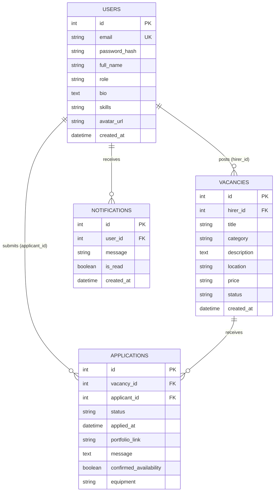

# JobLens — Project Report

A full-stack mobile job board for camera and film professionals.
**Stack:** Expo (React Native + TypeScript) · FastAPI (Python) · PostgreSQL · Docker · JWT authentication

This report explains **what was built, how it works, why each decision was made, what went wrong, and what I would improve.** Section 13 contains interview questions with model answers. Section 15 is a demo script.

---

## Table of contents

1. Executive summary
2. Problem, users and scope
3. Architecture overview
4. Technology choices and why
5. Database design
6. Backend design
7. Frontend design
8. End-to-end flows (step by step)
9. Docker and environment
10. Security review
11. Testing and verification
12. Development journey and challenges (bug stories)
13. Limitations and how I would scale it
14. Interview questions and model answers
15. Demo script and pre-interview checklist
16. Glossary

---

## 1. Executive summary

**One-sentence pitch:** JobLens connects film producers who need camera crews with camera professionals looking for work, in one mobile app with two roles.

**30-second version:**
"JobLens is a mobile app with a Python FastAPI backend and a PostgreSQL database. There are two account types. A _hirer_ posts a job, sees who applied, views the applicant's profile and hires someone. A _worker_ browses open jobs, fills an application form, and gets a notification when hired. Authentication uses JWT, passwords are hashed with Argon2, and access is controlled by role and by ownership, so a hirer only sees applicants for their own jobs. The backend runs in Docker and the app runs in Expo Go."

**What was built**

| Area           | Delivered                                                                                                     |
| -------------- | ------------------------------------------------------------------------------------------------------------- |
| Auth           | Register, login, JWT, session restore after app restart, logout                                               |
| Roles          | `hire` and `work`, enforced on the server and reflected in navigation                                         |
| Jobs           | Create, list (public feed and "mine"), get one, delete                                                        |
| Applications   | Apply with form data, list applicants, update status, duplicate prevention                                    |
| Profiles       | Real data on both profile screens, photo upload from the phone gallery, hirer can view an applicant's profile |
| Notifications  | Row created when someone is hired; worker sees a Notifications tab                                            |
| Infrastructure | Docker Compose (API + Postgres), healthcheck, persistent volumes                                              |

---

## 2. Problem, users and scope

**Problem.** Freelance camera crews are usually found through scattered social posts and messages. There is no single place to post a shoot, collect structured applications (portfolio, equipment, availability) and hire.

**Users**

| Role                       | Goals                                                                                  |
| -------------------------- | -------------------------------------------------------------------------------------- |
| Hire (producer/studio)     | Post shoots, compare applicants, hire, remove mistaken posts                           |
| Work (camera professional) | Discover shoots, apply with a portfolio and gear list, know when hired, keep a profile |

**In scope:** the core loop _post → discover → apply → review → hire → notify_.
**Out of scope for now:** payments, chat, ratings, push notifications, refresh tokens, admin panel.

---

## 3. Architecture overview

```text
 ┌──────────────┐      HTTP/JSON       ┌──────────────────────────────┐        ┌─────────────┐
 │  Expo app    │  (Bearer JWT header) │  FastAPI (uvicorn) container │  SQL   │ PostgreSQL  │
 │ React Native │ ───────────────────► │  routers → dependencies →    │ ─────► │ container   │
 │ + TypeScript │ ◄─────────────────── │  models/schemas              │ ◄───── │ (volume)    │
 └──────┬───────┘      JSON / images   └──────────────┬───────────────┘        └─────────────┘
        │                                             │
   SecureStore (JWT)                        /uploads static files (avatars)
```

**Request lifecycle (what happens on every call)**

1. The app calls `apiRequest()`, which adds `Authorization: Bearer <token>`.
2. The request travels over Wi-Fi to the laptop's port 8000, which Docker maps to the API container.
3. uvicorn passes it through the CORS middleware to the matching router function.
4. FastAPI resolves **dependencies**: `get_db` opens a database session; `get_current_user` decodes the JWT and loads the user; `require_role("hire")` checks the role.
5. The handler runs business logic using SQLAlchemy models against PostgreSQL.
6. The return value is validated and serialized through a Pydantic `response_model` (this is why `password_hash` is never sent).
7. The app receives JSON and updates state or the screen.

**Layering on the backend**

| Layer            | Folder                 | Responsibility                              |
| ---------------- | ---------------------- | ------------------------------------------- |
| Routers          | `app/routers`          | HTTP endpoints, status codes, orchestration |
| Dependencies     | `app/core/deps.py`     | Authentication, role checks, DB session     |
| Security helpers | `app/core/security.py` | Hashing, JWT create/decode                  |
| Schemas          | `app/schema`           | Request/response contracts (Pydantic)       |
| Models           | `app/models`           | Database tables (SQLAlchemy)                |

---

## 4. Technology choices and why

| Choice                  | Why I chose it                                                                                                                  | Alternatives and trade-off                                              |
| ----------------------- | ------------------------------------------------------------------------------------------------------------------------------- | ----------------------------------------------------------------------- |
| **FastAPI**             | Type hints give automatic validation and Swagger docs at `/docs`, which made testing every endpoint easy before touching the UI | Django REST (more batteries, heavier), Flask (less structure)           |
| **PostgreSQL**          | The data is relational (users, jobs, applications) and needs foreign keys, unique constraints and joins                         | MongoDB is flexible but I would lose enforced relations                 |
| **SQLAlchemy 2 (sync)** | Mature ORM, protects against SQL injection through parameterised queries                                                        | Async SQLAlchemy scales better under heavy I/O but adds complexity      |
| **Pydantic schemas**    | Separate what the API accepts/returns from what the DB stores                                                                   | Returning ORM models directly would leak fields such as `password_hash` |
| **JWT (PyJWT, HS256)**  | Stateless: the server does not store sessions, which suits a mobile client                                                      | Server sessions are easier to revoke but need shared storage            |
| **Argon2 (pwdlib)**     | Memory-hard, current best practice for password hashing                                                                         | bcrypt is also acceptable; plain hashes such as SHA-256 are not         |
| **Docker Compose**      | One command starts the API and database identically on any machine                                                              | Running Python and Postgres directly is fragile                         |
| **Expo + React Native** | One TypeScript codebase for Android and iOS, instant testing via Expo Go                                                        | Native Kotlin/Swift gives more control but doubles the work             |
| **TypeScript**          | Types on API responses catch mismatches at compile time                                                                         | Plain JavaScript is faster to write but error-prone                     |
| **Zustand**             | Very small global store, exactly enough for "who is logged in"                                                                  | Redux is heavier; Context is fine but re-renders more broadly           |
| **React Navigation**    | Standard navigation library, typed route params                                                                                 | Expo Router is file-based; I chose the explicit approach                |
| **expo-secure-store**   | Encrypted storage (Keychain/Keystore) for the token                                                                             | AsyncStorage is plain text, unsuitable for tokens                       |

---

## 5. Database design

### 5.1 Entity relationships



In words: one user (hirer) has many vacancies; one vacancy has many applications; one user (worker) has many applications; one user has many notifications. **Applications is the join table** between workers and vacancies, and it carries its own data (status, message, equipment).

### 5.2 Table details

**users** — one table for both roles, distinguished by `role` (`hire` or `work`). Email is unique. `password_hash` stores an Argon2id hash such as `$argon2id$v=19$m=65536,t=3,p=4$...` (64 MB memory cost, 3 iterations, 4 lanes). `skills` is a PostgreSQL text array. `avatar_url` stores a relative path such as `/uploads/avatars/<uuid>.jpg`, not the image itself.

**vacancies** — owned by a hirer (`hirer_id`). `status` is `open` or `closed`. `price` is currently a display string such as `Rs 5000`.

**applications** — `status` moves through `applied`, `shortlisted`, `hired`, `rejected`. Has a **unique constraint on (`vacancy_id`, `applicant_id`)**, so a worker can apply to a job only once. Extra form fields: `portfolio_link`, `message`, `confirmed_availability`, `equipment` (text array).

**notifications** — `user_id`, `message`, `is_read`, `created_at`.

### 5.3 Design decisions (and the honest trade-offs)

| Decision                                  | Reason                                                        | Trade-off                                                                                      |
| ----------------------------------------- | ------------------------------------------------------------- | ---------------------------------------------------------------------------------------------- |
| One `users` table with a `role` column    | Shared login/auth code, simple joins                          | Role-specific fields (studio name, gear list) would need extra profile tables as the app grows |
| `applications` as its own table           | Many-to-many with attributes and status workflow              | Needs joins to show names                                                                      |
| Unique constraint on (vacancy, applicant) | Database-level guarantee against duplicates, even under races | Application code must still handle the resulting error gracefully                              |
| Text arrays for `skills` and `equipment`  | Fast to build, no extra tables                                | Harder to query or filter than normalised tables                                               |
| `price` as a string                       | Quick to display                                              | Cannot sort or filter numerically; should be a numeric column plus currency                    |
| Avatar path stored, file stored on disk   | Keeps the DB small                                            | Local disk does not scale across servers; use object storage in production                     |

### 5.4 Schema changes and migrations

At startup the app calls `Base.metadata.create_all()`. This **creates missing tables only; it never alters an existing table.** When I added columns (`bio`, `skills`, `avatar_url` on users; `portfolio_link`, `message`, `confirmed_availability`, `equipment` on applications) I had to run `ALTER TABLE ... ADD COLUMN` manually in `psql`. In a real project this is the job of **Alembic migrations**, which version the schema and can be applied in CI and production. This is my biggest known technical debt on the database side.

---

## 6. Backend design

### 6.1 Project layout

```text
backend/app/
├── main.py            # app creation, CORS, static /uploads, router registration
├── database.py        # engine, Base, get_db dependency
├── core/
│   ├── config.py      # settings from environment (pydantic-settings)
│   ├── security.py    # hash_password, verify_password, create/decode token
│   └── deps.py        # get_current_user, require_role
├── models/            # user, vacancy, application, notification
├── schema/            # auth, vacancy, application, notification
└── routers/           # auth, vacancy, application, notification
```

### 6.2 Authentication in detail

**Register** — `POST /auth/register`

1. Validate the body with Pydantic (`email` must be a valid address, `role` must be `hire` or `work`).
2. Reject if the email already exists (400).
3. Hash the password with Argon2 and insert the user.
4. Return the user (via `UserOut`, no password hash). The app then asks the user to log in.

**Login** — `POST /auth/login`

1. Look up the user by email.
2. Verify the password against the stored hash. Wrong email and wrong password return the **same** 401 message, so attackers cannot discover which emails exist.
3. Create a JWT and return `{ access_token, token_type: "bearer", user }`.

**What a JWT is.** Three Base64 parts: `header.payload.signature`. My payload contains only `sub` (the user id as a string) and `exp` (expiry). The signature is an HMAC-SHA256 over header and payload using the server's secret. The server does not store tokens: it recomputes the signature and checks `exp`. If someone changes the payload, the signature no longer matches. JWTs are **signed, not encrypted**, so nothing sensitive should be placed inside.

**Protected requests.** `get_current_user`:

1. Reads the Bearer token from the `Authorization` header.
2. Decodes and verifies it (signature and expiry). Failure gives 401.
3. Loads the user by `sub`. If the user no longer exists, 401.

### 6.3 Authorization in detail

Authentication answers _who are you_. Authorization answers _what may you do_. I enforce it at two levels:

1. **Role-based access control.** `require_role("hire")` and `require_role("work")` are dependency factories. A worker calling a hirer-only endpoint gets **403 Forbidden**.
2. **Ownership checks.** Being a hirer is not enough. For example, viewing applicants loads the vacancy and compares `vacancy.hirer_id` with the current user's id. Another hirer's jobs behave as if they do not exist.
3. **Relationship-based access.** A hirer can read an applicant's profile only if that person applied to at least one of the hirer's jobs, checked with a join between `applications` and `vacancies`.

Status code conventions used: 200 OK, 201 Created (application), 204 No Content (delete), 401 not authenticated, 403 authenticated but not allowed, 404 not found, 409 conflict (duplicate application).

### 6.4 API reference

All routes are under `/api/v1`.

**Auth**

| Method | Route             | Who       | Purpose                  |
| ------ | ----------------- | --------- | ------------------------ |
| POST   | `/auth/register`  | anyone    | Create account           |
| POST   | `/auth/login`     | anyone    | Get token and user       |
| GET    | `/auth/me`        | logged in | Current user             |
| PATCH  | `/auth/me`        | logged in | Update name, bio, skills |
| POST   | `/auth/me/avatar` | logged in | Upload profile photo     |

**Vacancies**

| Method | Route             | Who         | Purpose                               |
| ------ | ----------------- | ----------- | ------------------------------------- |
| POST   | `/vacancies`      | hire        | Create a job                          |
| GET    | `/vacancies`      | anyone      | Open jobs feed with `applicant_count` |
| GET    | `/vacancies/mine` | hire        | My jobs with `applicant_count`        |
| GET    | `/vacancies/{id}` | anyone      | One job                               |
| DELETE | `/vacancies/{id}` | hire, owner | Delete job and its applications       |

**Applications**

| Method | Route                          | Who         | Purpose                                                       |
| ------ | ------------------------------ | ----------- | ------------------------------------------------------------- |
| POST   | `/applications`                | work        | Apply (201; 409 if duplicate; 404 if job missing or not open) |
| GET    | `/applications/me`             | work        | My applications                                               |
| GET    | `/applications/me/hired`       | work        | Jobs I was hired for, with job details                        |
| GET    | `/applications/vacancy/{id}`   | hire, owner | Applicants of one job                                         |
| GET    | `/applications/applicant/{id}` | hire        | Applicant profile (only if they applied to my job)            |
| PATCH  | `/applications/{id}/status`    | hire, owner | Set status; `hired` also creates a notification               |

**Notifications**

| Method | Route                      | Who       | Purpose                        |
| ------ | -------------------------- | --------- | ------------------------------ |
| GET    | `/notifications`           | logged in | My notifications, newest first |
| PATCH  | `/notifications/{id}/read` | logged in | Mark as read                   |

**Example: login response**

```json
{
  "access_token": "eyJhbGciOiJIUzI1NiIs...",
  "token_type": "bearer",
  "user": {
    "id": 1,
    "full_name": "Bishnu Shrestha",
    "email": "bishnu@gmail.com",
    "role": "hire",
    "bio": null,
    "skills": [],
    "avatar_url": null
  }
}
```

**Example: apply request**

```json
{
  "vacancy_id": 1,
  "portfolio_link": "https://vimeo.com/showreel",
  "message": "5 years of wedding cinematography",
  "confirmed_availability": true,
  "equipment": ["Sony FX6", "DJI Ronin RS3"]
}
```

**Example: applicant list item (hirer view)**

```json
{
  "application_id": 2,
  "status": "applied",
  "applied_at": "2026-09-25T06:44:29Z",
  "applicant_id": 2,
  "full_name": "Suniti Shrestha",
  "email": "suniti@example.com",
  "portfolio_link": "https://sophiya.com",
  "message": "I can do anything",
  "equipment": []
}
```

### 6.5 Computed field: `applicant_count`

Each vacancy returned by the list endpoints includes how many people applied. The router loops over vacancies and runs a `COUNT` query for each. This works but is an **N+1 query pattern**. The improvement is one grouped query:

```sql
SELECT v.*, COUNT(a.id) AS applicant_count
FROM vacancies v LEFT JOIN applications a ON a.vacancy_id = v.id
GROUP BY v.id;
```

### 6.6 File upload (profile photo)

1. The app sends `multipart/form-data` with the picked image.
2. The server checks the extension against an allow-list (`.jpg .jpeg .png .webp`) and rejects files over 5 MB.
3. It saves the file as `uploads/avatars/<random uuid><ext>`. A random name prevents collisions and stops a user-supplied filename from being used in a path (path traversal).
4. It deletes the user's previous avatar file so files do not pile up.
5. It stores the relative URL in `users.avatar_url` and returns the updated user.
6. `main.py` mounts `/uploads` as static files, so the phone can load `http://<host>:8000/uploads/avatars/<file>`.
7. A Docker volume (`./backend/uploads:/app/uploads`) keeps files when the container is rebuilt.

_Limitations:_ only the extension is validated (not the real file content), and local disk does not work with several servers. Production would use S3 or Cloudinary with signed URLs.

### 6.7 Notifications

When a hirer sets an application to `hired`, the same request inserts a `notifications` row for the worker ("Congratulations! You've been hired for ..."). The worker's app reads them: the Notifications tab lists jobs from `GET /applications/me/hired`, and the home screen fetches unread notifications on load and marks them read. This is **pull-based**: the app has to ask. Real-time delivery would need push notifications (Expo Push/FCM) or WebSockets.

### 6.8 Errors

FastAPI's `HTTPException(status_code, detail="...")` returns `{"detail": "..."}`. The frontend `apiRequest` reads `detail` and throws an `Error` with that message, so screens can show it in an alert. Unexpected exceptions become a 500 and appear in `docker compose logs api`.

---

## 7. Frontend design

### 7.1 Structure

```text
frontend/src/
├── api/         client.ts, auth.ts, vacancies.ts, applications.ts, notifications.ts
├── store/       authStore.tsx        (Zustand)
├── navigation/  AppNavigator, AuthStack, HireStack, WorkStack, types.ts
├── constants/   theme.ts             (colours, spacing, radius)
└── screen/      Login, Register, Hire*, Work*, WorkerProfileView
```

### 7.2 API layer

`apiRequest<T>(path, options)` is the single doorway to the backend. It prepends the base URL from `app.json` (`expo.extra.apiUrl`), sets JSON headers, **reads the token from SecureStore and adds the Bearer header automatically**, parses the JSON body, and converts error responses to thrown errors. The generic `<T>` gives every call a typed result. The TypeScript types (`User`, `Vacancy`, `Application`, `Applicant`) mirror the Pydantic schemas so a mismatch is caught at compile time.

The avatar upload calls `fetch` directly with `FormData` because `apiRequest` forces `Content-Type: application/json`, which would break multipart uploads (the boundary must be generated automatically).

### 7.3 State and session restore

The Zustand store holds `user`, `accessToken`, `isLoading` and actions `login`, `logout`, `restoreSession`, `setUser`.

- `login(response)` saves the token in SecureStore and puts the user in state.
- `logout()` deletes the token and clears state.
- `restoreSession()` runs when the app starts: read the token, call `GET /auth/me`, and set the user. If it fails (expired or invalid), delete the token. `App.tsx` shows nothing until `isLoading` is false, which prevents a flash of the login screen.
- `setUser(user)` lets a screen update the user immediately, for example after uploading a new avatar.

### 7.4 Navigation

`AppNavigator` decides what to render from state: no user shows `AuthStack`; role `hire` shows `HireStack`; otherwise `WorkStack`. Because navigation follows state, logging in or out switches stacks automatically and there is no manual "go to home" call.

| Stack | Screens (route names)                                                                            |
| ----- | ------------------------------------------------------------------------------------------------ |
| Auth  | Login, Register                                                                                  |
| Hire  | HireHome, HirePost, HireProfile, HireApplicants (`vacancyId`), WorkerProfileView (`applicantId`) |
| Work  | WorkHome, WorkApply (`vacancyId`), WorkProfile, WorkNotifications                                |

Route params are typed in `types.ts`. Small `...Route` wrapper components turn `navigation.navigate(...)` into simple callback props, which keeps the screen components independent of React Navigation.

### 7.5 Screens

| Screen                    | Purpose                                                                     | API                                               |
| ------------------------- | --------------------------------------------------------------------------- | ------------------------------------------------- |
| Login / Register          | Authenticate                                                                | `loginUser`, `registerUser`                       |
| HireHomePage              | Stats, my jobs, applicant counts, delete with confirmation                  | `myVacancies`, `deleteVacancy`                    |
| HirePostEvent             | Create job from a form; title is built from event type and city             | `createVacancy`                                   |
| HireJobapplicant          | List and search applicants; View Profile; Select and Hire with confirmation | `applicantsForVacancy`, `updateApplicationStatus` |
| WorkerProfileView         | Read-only applicant profile                                                 | `getApplicantProfile`                             |
| WorkHomePage              | Open jobs feed, Apply Now, unread notification alerts                       | `listVacancies`, `getMyNotifications`             |
| WorkApply                 | Application form                                                            | `getVacancy`, `applyToVacancy`                    |
| WorkNotifications         | Jobs I was hired for; empty state otherwise                                 | `getMyHiredJobs`                                  |
| HireProfile / WorkProfile | Real profile data, change photo, logout                                     | `uploadAvatar`                                    |

### 7.6 Profile photo on the client

`expo-image-picker` asks for gallery permission, opens the gallery with a square crop, returns a local file URI, and `uploadAvatar` posts it as `FormData`. The returned user goes into the store via `setUser`, so the new image shows immediately. If the user has no photo, a generated cartoon avatar (DiceBear, seeded by email) is shown.

---

## 8. End-to-end flows (step by step)

### Flow A — Register and log in

1. RegisterPage → `POST /auth/register` `{ email, password, full_name, role }`.
2. Server validates, checks the email is unused, stores the Argon2 hash, returns the user.
3. User goes to LoginPage → `POST /auth/login`.
4. Server verifies the hash, issues a JWT (`sub` = user id, `exp`), returns token and user.
5. The app saves the token in SecureStore and the user in Zustand.
6. `AppNavigator` sees `user.role` and shows the right stack.

### Flow B — Reopening the app

1. `App.tsx` calls `restoreSession()`.
2. Token found → `GET /auth/me` with the Bearer header.
3. Success: user restored, home screen shown with no login. Failure: token deleted, login screen shown.

### Flow C — Hirer posts a job

1. HirePostEvent collects event type, location, date, time, people, budget, gear.
2. It maps these to `{ title, category, description, location, price }`.
3. `POST /vacancies` with the hirer's token. `require_role("hire")` passes; `hirer_id` is taken from the **token**, never from the request body (so a user cannot post as someone else).
4. Row inserted in `vacancies` with status `open`; the app navigates back to the dashboard.

### Flow D — Worker discovers and applies

1. WorkHomePage calls `GET /vacancies` (open jobs, newest first) and renders cards.
2. Tapping **Apply Now** navigates to WorkApply with `vacancyId`.
3. WorkApply loads the job (`GET /vacancies/{id}`) for the header.
4. The worker enters portfolio link, message, ticks availability and picks equipment.
5. Submit → `POST /applications`. Server checks: user is `work`; job exists and is open; no existing application by this user for this job (409 otherwise).
6. Row inserted with status `applied`. The worker sees "Application submitted".
7. The job's `applicant_count` now increases on the hirer's dashboard.

### Flow E — Hirer reviews, views profile, hires

1. HireHomePage shows the job with its applicant count. Tapping the card opens HireApplicants.
2. `GET /applications/vacancy/{id}`: server verifies the job belongs to this hirer, joins `applications` with `users` and returns name, email, message, equipment, status.
3. **View Profile** → `GET /applications/applicant/{id}`: server confirms this person applied to one of the hirer's jobs, then returns the profile (bio, skills, photo).
4. **Select and Hire** shows a confirmation ("Are you sure you want to hire ...?"). On Yes → `PATCH /applications/{id}/status` `{ "status": "hired" }`.
5. Server checks ownership, updates the status, and inserts a notification for the worker.
6. The card shows "Hired ✓".

### Flow F — Worker sees the hire

1. The worker opens the Notifications tab → `GET /applications/me/hired`.
2. The server joins the worker's `hired` applications with vacancy details and returns title, location and price.
3. The screen lists them, or shows an empty state if none.
4. On the home screen, unread rows from `GET /notifications` appear as alerts and are marked read.

### Flow G — Hirer deletes a job

1. Trash icon → confirmation dialog ("Delete this job?").
2. On confirm → `DELETE /vacancies/{id}`.
3. Server checks ownership, **deletes the job's applications first, then the job**, and returns 204.
4. The app removes the card locally. Workers no longer see the job the next time the feed loads, because both dashboards read the same table.

### Flow H — Changing the profile photo

1. Tap avatar → permission prompt → gallery → crop.
2. `POST /auth/me/avatar` multipart.
3. Server validates, saves the file, updates `avatar_url`, removes the old file.
4. The app updates the store; the image is fetched from `/uploads/...`.

---

## 9. Docker and environment

**Services (docker-compose.yml)**

| Service | Details                                                                                                                                                                                                                                                     |
| ------- | ----------------------------------------------------------------------------------------------------------------------------------------------------------------------------------------------------------------------------------------------------------- |
| `db`    | `postgres:16-alpine`, database/user `joblens`, named volume `postgres_data` so data survives restarts, **healthcheck** (`pg_isready`). Port 5432 is not published to the host, so the database is only reachable from other containers or via `docker exec` |
| `api`   | Built from `./backend/Dockerfile`, reads `backend/.env`, exposes port 8000, `depends_on` the db with `condition: service_healthy` so the API waits until Postgres is ready, mounts `./backend/uploads` for avatars                                          |

**Important behaviours I learned**

- The API's Python code is **copied into the image at build time**. Edits do not appear until `docker compose up --build -d`.
- Containers reach each other by **service name** (the API connects to host `db`), not `localhost`.
- On the phone, `localhost` means the phone. The app therefore uses the laptop's Wi-Fi IP (`app.json` → `expo.extra.apiUrl`). Phone and laptop must be on the same network, and the firewall must allow port 8000.
- `docker compose down` keeps the database volume; `down -v` deletes it.

**Configuration** lives in environment variables (`backend/.env`): database URL, `JWT_SECRET`, algorithm, token lifetime, allowed origins. It is never committed; `.env.example` documents the names.

---

## 10. Security review

| Topic            | What is in place                                                       | Gap or next step                                                                                        |
| ---------------- | ---------------------------------------------------------------------- | ------------------------------------------------------------------------------------------------------- |
| Passwords        | Argon2id hashes, never stored or returned in plain text                | Add password-strength rules and a reset flow                                                            |
| Tokens           | Signed JWT with expiry; stored in SecureStore on the device            | No refresh token or revocation; add short-lived access token plus refresh token                         |
| Authorization    | Role checks plus ownership checks plus relationship check for profiles | Add automated tests for each rule                                                                       |
| Injection        | SQLAlchemy uses parameterised queries; Pydantic validates input        | Keep avoiding raw SQL string building                                                                   |
| User enumeration | Same error for wrong email and wrong password                          | Registration still reveals "email already registered" (a common trade-off)                              |
| File upload      | Extension allow-list, size limit, random filenames, old file removed   | Validate real content type; scan; move to object storage                                                |
| Transport        | Plain HTTP on the local network for development                        | HTTPS through a reverse proxy (nginx/Caddy) or a cloud load balancer                                    |
| CORS             | Enabled for development                                                | Restrict to known origins in production (native mobile apps do not enforce CORS, but a web build would) |
| Rate limiting    | None                                                                   | Add login rate limiting to slow brute force                                                             |
| Secrets          | In environment variables, not in code                                  | Use a secrets manager in production; rotate `JWT_SECRET`                                                |

---

## 11. Testing and verification

Honest summary: **testing so far has been manual, not automated.**

- **Swagger UI (`/docs`)** for every endpoint: register, log in, Authorize, then call routes and inspect status codes and bodies. This was the main tool, and it is how the JWT bug was isolated.
- **`psql`** inside the database container to confirm rows and columns (`\dt`, `SELECT * FROM applications;`).
- **`docker compose logs api`** for Python tracebacks.
- **`npx tsc --noEmit`** to type-check the frontend.
- **Two accounts on the phone** (one hire, one work) to walk the full loop.

**What I would add:** `pytest` with `httpx`/`TestClient` and a test database for auth, role checks, ownership checks, duplicate applications and delete; frontend tests for the store and API layer; a CI pipeline (GitHub Actions) that runs type-check, tests and a Docker build.

---

## 12. Development journey and challenges

**Phases**

1. **Auth foundation:** Docker + Postgres + FastAPI; user model; register/login; JWT; verified in Swagger; verified rows in `psql`.
2. **App shell:** Zustand store, SecureStore, session restore, React Navigation with role-based stacks.
3. **Job board core:** vacancies and applications (models, schemas, routers); dashboards replaced hardcoded demo data with real API data.
4. **Profiles:** bio/skills/avatar columns, real profile screens, gallery photo upload with static file serving.
5. **Hiring workflow:** applicant list, applicant profile view, hire confirmation, notifications table, worker Notifications tab, delete job.

**Bug stories (good for "tell me about a difficult bug")**

| Problem                                                                        | How I found it                                                                               | Root cause                                                                                                                                      | Fix and lesson                                                                                                                        |
| ------------------------------------------------------------------------------ | -------------------------------------------------------------------------------------------- | ----------------------------------------------------------------------------------------------------------------------------------------------- | ------------------------------------------------------------------------------------------------------------------------------------- |
| Every protected endpoint returned 500                                          | Read the traceback in `docker compose logs api`: `invalid literal for int(): "{'sub': '1'}"` | Login called `create_access_token({"sub": ...})`, but the function already builds the payload, so the dict was stringified into the `sub` claim | Pass the plain `user.id`. Lesson: read the stack trace, and trace the value backwards from where it fails                             |
| "Method Not Allowed" when applying                                             | Swagger showed only one applications route                                                   | Router and frontend imports pointed at differently named files (singular vs plural) so an old stub was serving                                  | Make module names match exactly. Lesson: check what is actually running, not what you believe you wrote                               |
| API container kept disappearing, app said "Network request failed"             | `docker compose ps` showed only the database                                                 | Startup crashed on an import error, so nothing listened on port 8000                                                                            | Run `docker compose up --build` in the foreground to see the crash. Lesson: "network error" in the app often means the server is down |
| `ModuleNotFoundError: app.routers.notification` even though the file "existed" | `docker compose run --rm api ls -la app/routers/` listed the real filenames inside the image | The file was named `notification,py` (comma instead of dot)                                                                                     | Rename it. Lesson: inspect inside the container, not just the editor                                                                  |
| Delete job returned 500                                                        | Traceback showed a NOT NULL violation on `applications.vacancy_id`                           | On delete, the ORM tried to set the child rows' foreign key to NULL                                                                             | Delete applications first, then the job (or configure cascade). Lesson: understand ORM delete behaviour and FK constraints            |
| New columns not appearing                                                      | Queries failed on missing columns                                                            | `create_all()` never alters existing tables                                                                                                     | Manual `ALTER TABLE`; long-term Alembic                                                                                               |
| Navigation error "action NAVIGATE was not handled"                             | Error text named the missing screen                                                          | Screen component existed but was never registered as a `Stack.Screen`                                                                           | Register it and add it to the param list type                                                                                         |
| Two avatars on one screen                                                      | Compared the screenshot with the JSX                                                         | Two `<Image>` elements bound to the same variable                                                                                               | Keep one tappable avatar                                                                                                              |
| Expo Go refused to open the project                                            | Error listed SDK 57 vs 54                                                                    | Phone auto-updated Expo Go past the project's SDK                                                                                               | Install the SDK 54 Expo Go build and disable auto-update                                                                              |
| Photo upload appeared to fail                                                  | Isolated by testing `POST /auth/me/avatar` in Swagger                                        | Underlying cause was the JWT bug above, not the upload code                                                                                     | Lesson: when a feature fails, test the layer below it first                                                                           |

**General debugging method I used:** reproduce → identify the layer (app, network, API, database) → test that layer in isolation (Swagger, `psql`, logs) → read the exact error → fix one thing → retest.

---

## 13. Limitations and how I would scale it

**Known limitations (be upfront about these)**

- No refresh tokens or token revocation.
- No automated tests; manual verification only.
- `create_all` plus manual `ALTER TABLE` instead of Alembic.
- `applicant_count` uses N+1 queries; lists are not paginated.
- Duplicate-application check is "check then insert", so two simultaneous requests could both pass the check; the unique constraint then raises an unhandled error (should be caught and turned into 409).
- Hiring the same person twice would create two notifications (the UI disables the button, the API does not guard it).
- Endpoints are synchronous (FastAPI runs them in a threadpool), which is fine at this scale.
- Uploads live on local disk; notifications are pull-based.
- Some tech debt: Pydantic v1-style `.dict()` and `class Config`, and `@app.on_event("startup")` are deprecated in favour of `model_dump()`, `ConfigDict` and lifespan handlers.
- A few dashboard elements are still placeholders (recent-applicants feed, status badges).

**Scaling plan**

| Concern                | Plan                                                                                                                                            |
| ---------------------- | ----------------------------------------------------------------------------------------------------------------------------------------------- |
| Slow lists             | Pagination (`limit`/`offset` or cursor), grouped count query                                                                                    |
| Query speed            | Indexes on `vacancies(status, created_at)`, `applications(vacancy_id)`, `applications(applicant_id)`; Postgres does not auto-index foreign keys |
| Read-heavy public feed | Cache with Redis; short TTL                                                                                                                     |
| Concurrency            | Run multiple uvicorn/gunicorn workers behind a load balancer; JWTs are stateless so any instance can serve any request                          |
| Files                  | Object storage (S3/Cloudinary) plus CDN                                                                                                         |
| Notifications          | Expo Push/FCM for background delivery, WebSockets for live updates; queue (Celery/RQ) for slow work                                             |
| Schema evolution       | Alembic migrations in CI                                                                                                                        |
| Reliability            | Health checks, structured logging, error tracking (Sentry), automated backups                                                                   |
| Delivery               | GitHub Actions running tests, type-check, Docker build; deploy to a VPS or managed platform behind HTTPS                                        |

---

## 14. Interview questions and model answers

_Tip: answer in your own words, keep answers to 30–60 seconds, and only claim what you understand and have tested. It is fine to say a feature is untested or a known limitation._

### About the project

**Q: Tell me about your project.**
JobLens is a job board for camera professionals. Producers post shoots, workers apply with a portfolio and equipment list, and producers review applicants and hire. It is an Expo React Native app with a FastAPI and PostgreSQL backend in Docker. I focused on authentication, role-based authorization and the full post → apply → hire → notify flow.

**Q: Why did you build this?**
I wanted a realistic project that forces real backend decisions: relational modelling, auth, permissions, file uploads and deployment, rather than a simple CRUD demo.

**Q: What was the hardest part?**
Debugging across layers. A single JWT payload bug made every protected request fail, and it looked like a file-upload problem at first. I learned to test each layer in isolation and read the traceback carefully.

**Q: What would you do differently?**
Start with Alembic migrations and automated tests from day one, use async DB access if traffic demanded it, and design profile tables per role earlier.

### Backend and API design

**Q: Why FastAPI?**
Type hints produce validation and interactive docs automatically, dependency injection makes auth and DB sessions clean, and it is fast. Swagger meant I could test each endpoint before building UI.

**Q: What is dependency injection in FastAPI?**
Functions declared with `Depends()` that FastAPI calls before the handler and passes in. I use `get_db` for a session, `get_current_user` to authenticate, and `require_role("hire")` to authorise. This keeps handlers small and the rules reusable.

**Q: Why separate Pydantic schemas from database models?**
Models describe storage; schemas describe the API contract. Separating them lets me control exactly what leaves the server (never `password_hash`), validate input, and change the DB without breaking the API.

**Q: Explain your REST design and status codes.**
Nouns for resources (`/vacancies`, `/applications`), HTTP verbs for actions (POST create, GET read, PATCH partial update, DELETE remove). 201 for creation, 204 for delete, 401 unauthenticated, 403 forbidden, 404 not found, 409 conflict for a duplicate application.

**Q: PUT vs PATCH?**
PUT replaces the whole resource; PATCH changes only the supplied fields. Updating an application's status or a profile's bio is a partial change, so PATCH.

**Q: 401 vs 403?**
401 means the server does not know who you are (missing or bad token). 403 means it knows you but you are not allowed, for example a worker calling a hirer-only route.

**Q: Sync or async endpoints?**
My endpoints are synchronous with a synchronous SQLAlchemy session; FastAPI runs them in a threadpool, which I saw in the tracebacks. It is simple and adequate here. For high concurrency I would move to async SQLAlchemy with an async driver.

**Q: What is CORS and did you need it?**
A browser rule that blocks a page from calling a different origin unless the server allows it. Native mobile apps do not enforce it, but I enabled it for web testing and would restrict allowed origins in production.

### Authentication and security

**Q: How does login work?**
The client posts email and password. The server finds the user, verifies the password against the Argon2 hash, and returns a signed JWT. The app stores it in SecureStore and sends it as a Bearer header on every request.

**Q: What is a JWT and is it encrypted?**
A signed token of header, payload and signature. Signed, not encrypted: anyone can read the payload, but nobody can change it without breaking the signature. So I only store the user id and expiry.

**Q: JWT vs server sessions?**
JWTs are stateless: no session store, easy to scale horizontally, natural for mobile. The downside is revocation: a stolen token is valid until expiry. Sessions are easy to revoke but need shared storage. I would add short-lived access tokens with refresh tokens.

**Q: Hashing vs encryption? Why Argon2?**
Hashing is one-way; encryption is reversible. Passwords should be hashed. Argon2id is deliberately slow and memory-hard, which makes brute-forcing expensive. My hashes use 64 MB memory, 3 iterations.

**Q: Where do you store the token on the phone and why?**
`expo-secure-store`, which uses the Keychain/Keystore. AsyncStorage is plain text and not suitable for credentials.

**Q: How do you stop a hirer seeing another hirer's applicants?**
Every hirer endpoint checks ownership on the server: it loads the vacancy and compares `hirer_id` with the token's user. The client is never trusted for identity; `hirer_id` comes from the token.

**Q: How can a hirer see a worker's profile safely?**
Only if that worker applied to one of the hirer's jobs. The endpoint checks with a join and returns 403 otherwise, so profiles cannot be scraped by id.

**Q: How do you prevent SQL injection?**
The ORM builds parameterised queries and Pydantic validates types. I never concatenate user input into SQL.

**Q: What are the security weaknesses of your app?**
HTTP instead of HTTPS in development, no refresh tokens or revocation, no rate limiting on login, permissive CORS, file type validated only by extension. I know how each would be addressed (see section 10).

### Database

**Q: Why PostgreSQL?**
The data is relational with foreign keys, unique constraints and joins, and Postgres also offers array columns which I use for skills and equipment.

**Q: Explain your schema.**
Users (both roles), vacancies owned by a hirer, applications linking a worker to a vacancy with status and form data, and notifications per user. Applications is a many-to-many join table with its own attributes.

**Q: How do you prevent duplicate applications?**
A unique constraint on (vacancy_id, applicant_id) at the database level, plus an application-level check that returns 409 with a friendly message. The constraint is the real guarantee because it also holds under race conditions; I would additionally catch `IntegrityError` to return 409.

**Q: What is the N+1 problem and where is it in your app?**
Running one query for a list and then one more per item. Computing `applicant_count` per vacancy does this. Fix: a single `LEFT JOIN ... GROUP BY` query.

**Q: What happens when a job with applicants is deleted?**
The route deletes the applications first, then the job, in one transaction. Originally the ORM tried to null the foreign key and the database rejected it. Alternatives are `ON DELETE CASCADE` or ORM cascade settings; another option is soft delete (`status = closed`) to keep history.

**Q: How do you change the schema safely?**
With migrations (Alembic): versioned scripts applied in order. I currently used `create_all` plus manual `ALTER TABLE`, which does not scale and is on my improvement list.

**Q: Why is price a string?**
It was fastest for display. It prevents numeric sorting and filtering, so I would change it to a numeric column plus a currency code.

### Frontend

**Q: How do you manage state?**
Zustand for the auth user and token; component state (`useState`) for screen data such as job lists. It is small and enough for this app. Redux or React Query would make sense with more shared server state.

**Q: How does navigation choose the right screens?**
`AppNavigator` renders a stack based on auth state and role. Because it is state-driven, login and logout switch stacks automatically.

**Q: How do you keep the user logged in after closing the app?**
On startup `restoreSession()` reads the token from SecureStore, calls `/auth/me`, and restores the user; if the call fails the token is discarded.

**Q: How do you keep frontend and backend types in sync?**
TypeScript types mirror the Pydantic schemas. If the backend response shape changes, the compiler flags the affected screens. Generating types from the OpenAPI spec would automate it.

**Q: How does the photo upload work?**
The image picker returns a local URI, I wrap it in `FormData` and POST it as multipart with the Bearer header. I call `fetch` directly because forcing a JSON content type would break the multipart boundary.

### Docker and infrastructure

**Q: What does Docker Compose do for you?**
Starts the API and Postgres together with the same configuration everywhere, wires them on a private network, waits for the database healthcheck before starting the API, and persists data in a named volume.

**Q: Why did code changes not show up after editing?**
The code is copied into the image at build time, so I must rebuild with `docker compose up --build`. For faster development I could bind-mount the source and run uvicorn with `--reload`.

**Q: How does the phone reach the backend?**
Through the laptop's Wi-Fi IP on port 8000, which Docker maps to the API container. `localhost` on the phone would point to the phone itself.

### Scaling and improvement

**Q: How would you scale this to many users?**
Paginate lists, add indexes on foreign keys and status, cache the public feed, run multiple stateless API instances behind a load balancer, move files to S3 with a CDN, use push notifications and background workers, and add monitoring. JWTs being stateless makes horizontal scaling straightforward.

**Q: How would you implement real-time notifications?**
Register device push tokens and send with Expo Push or FCM when a hire happens, optionally WebSockets for live in-app updates. Today the app polls on load.

**Q: How would you test it?**
Pytest with a test database for auth, role and ownership rules, duplicate applications and delete behaviour; contract checks against the OpenAPI schema; frontend tests for the store; CI to run them on every push.

**Q: What would you build next?**
Refresh tokens, an edit-profile screen, pagination, real recent-applicants feed, push notifications, Alembic, and tests.

### Behavioural

**Q: Describe a bug you solved.**
Use the JWT `sub` story: symptom (500 on every protected route), method (read the traceback, saw the dict inside `sub`), root cause (double wrapping in the login handler), fix (pass `user.id`), lesson (trace values back from the failure and test lower layers first).

**Q: Did you use AI tools?**
If asked, answer honestly: you used AI assistance for guidance, but you can walk through every file, explain the design choices, run the system, and debug it. That is what interviewers actually check, so make sure it is true by re-reading the code and running the demo.

---

## 15. Demo script and pre-interview checklist

**3–5 minute demo (two accounts: one hire, one work)**

1. Show `docker compose ps` (both containers up) and Swagger at `/docs`.
2. App: log in as **hire**. Point out the real name and job list.
3. Post a job. Explain the `POST /vacancies` call and that `hirer_id` comes from the token.
4. Log out, log in as **work**. The new job appears in the feed.
5. Tap Apply Now, fill the form, submit. Explain the unique constraint and the 409 case.
6. Back as **hire**: the applicant count increased; open the job, view the applicant's profile, hire with the confirmation dialog.
7. As **work**: open Notifications and see the hire.
8. Show `psql`: `SELECT * FROM applications;` and `SELECT * FROM notifications;`.
9. Show a profile photo upload and mention where the file is stored.
10. Mention limitations and next steps (section 13).

**Checklist before the interview**

- [ ] Backend up: `docker compose ps` shows `api` and `db`; `/health` returns ok.
- [ ] Phone on the same Wi-Fi; `apiUrl` in `app.json` matches `ipconfig`.
- [ ] Expo Go is the SDK 54 build.
- [ ] Run the full loop once with two accounts. Confirm the items still marked "needs testing": View Profile, hire + notification, Notifications tab, delete confirmation.
- [ ] `npx tsc --noEmit` passes.
- [ ] `.env` and `uploads/` are not committed; README and this report are in the repo.
- [ ] You can explain, from memory: JWT, Argon2, role vs ownership checks, the unique constraint, the delete-order bug, and why `create_all` is not enough.

---

## 16. Glossary

| Term                     | Meaning                                                               |
| ------------------------ | --------------------------------------------------------------------- |
| API                      | The set of HTTP endpoints the app calls                               |
| REST                     | Design style using resources and HTTP verbs                           |
| JWT                      | Signed token proving identity without server-side sessions            |
| Bearer token             | A token sent in the `Authorization: Bearer <token>` header            |
| Hashing                  | One-way transformation used for passwords                             |
| Argon2                   | A memory-hard password hashing algorithm                              |
| RBAC                     | Role-based access control (hire vs work)                              |
| Ownership check          | Verifying the resource belongs to the requesting user                 |
| ORM                      | Maps database tables to Python classes (SQLAlchemy)                   |
| Foreign key              | A column referencing another table's primary key                      |
| Unique constraint        | Database rule preventing duplicate values or combinations             |
| Migration                | A versioned change to the database schema                             |
| N+1 queries              | One query for a list plus one per item; usually avoidable with a join |
| Dependency injection     | Framework supplies required objects (DB session, user) to functions   |
| Pydantic                 | Library for data validation and serialization                         |
| CORS                     | Browser rule controlling cross-origin requests                        |
| Docker image / container | Packaged application / running instance of it                         |
| Volume                   | Persistent storage that outlives a container                          |
| Healthcheck              | A command that reports whether a service is ready                     |
| Multipart form data      | HTTP encoding used for file uploads                                   |
| Zustand                  | Lightweight React state library                                       |
| SecureStore              | Encrypted key-value storage on the device                             |
